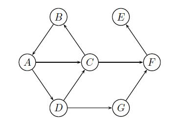
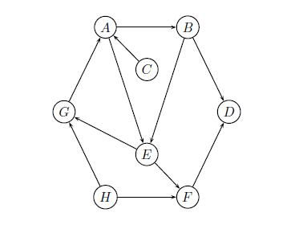
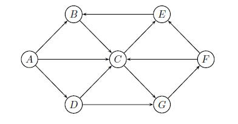
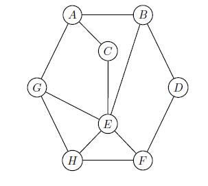
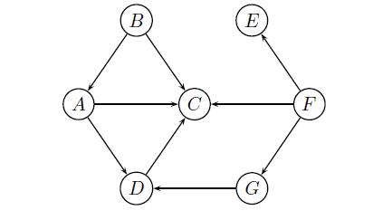
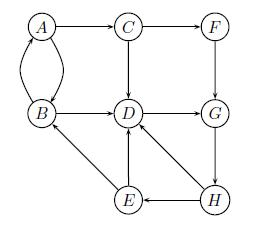

Grafos
======

Ex01
----

Qual a sequência de vértices visitados numa travessia em profundidade
primeiro (DFS) sobre o grafo abaixo. Considere que os vértices são
visitados por ordem alfabética e que os vértices adjacentes de um
vértice também são visitados por ordem alfabética.

Ex02
----

Considere uma travessia em profundidade primeiro (DFS) do grafo abaixo,
e na qual os vértices são visitados por ordem alfabética e os vértices
adjacentes de um vértice também são visitados por ordem alfabética.
Indique os arcos de árvore DF.

Ex03
----

Considere uma travessia em profundidade primeiro (DFS) sobre o grafo
abaixo. Considere ainda que os vértices são visitados por ordem
alfabética e que os vértices adjacentes de um vértice são também
visitados por ordem alfabética. Qual o número de arcos para trás e de
cruzamento que resultam da execução desta travessia? Os arcos para trás
(back edges) ligam um nó com o seu predecessor na árvore DF, os arcos de
cruzamento (cross edges) ligam nós n1 e n2 se n1 não é predecessor do n2
e nem n2 é predecessor do n1.

Ex04
----

Qual a sequência de vértices visitados numa travessia em largura
primeiro (BFS) sobre o grafo abaixo, com origem no vértice A? Considere
que os vértices adjacentes de um vértice são visitados por ordem
alfabética.

Ex05
----

Qual das sequências de vértices corresponde a uma ordenação topológica
do grafo abaixo? Lemra-se do algoritmo para calculá-la?

1.  &lt;A,B,C,D,E,F,G&gt;
2.  &lt;B,A,D,C,G,F,E&gt;
3.  &lt;B,A,D,F,E,G,C&gt;
4.  &lt;B,F,A,E,D,C,G&gt;
5.  &lt;C,G,E,B,A,D,F&gt;
6.  &lt;F,E,G,D,C,B,A&gt;
7.  &lt;F,G,E,B,A,D,C&gt;

Ex05
----

Qual o número de componentes fortemente ligados do grafo dirigido da
figura abaixo. Lemra-se do algoritmo para calculá-los?

